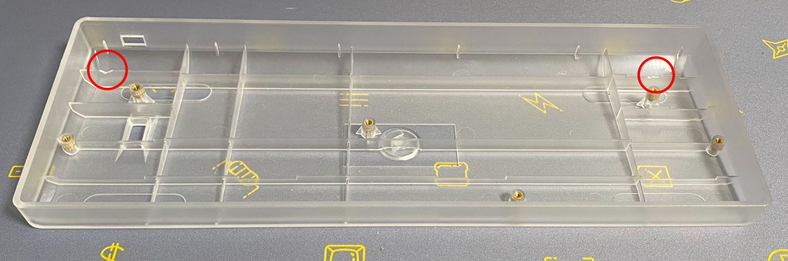

# 動作確認済みケース

## 60% プラスチックケース

https://yushakobo.jp/shop/60-plastic-case/

- 一部干渉するためケースの加工が必須
- ダイオードが干渉するので赤丸の場所をニッパーで切るかヤスリで干渉しないようにして下さい。

## KBDFANS TOFU 60% ALUMINUM CASE
https://yushakobo.jp/shop/kbdfans-tofu-60-aluminum-case/

- 付属のネジは長さが足りないためトッププレートと併用不可（キット付属のネジを使用すれば使用可能）
